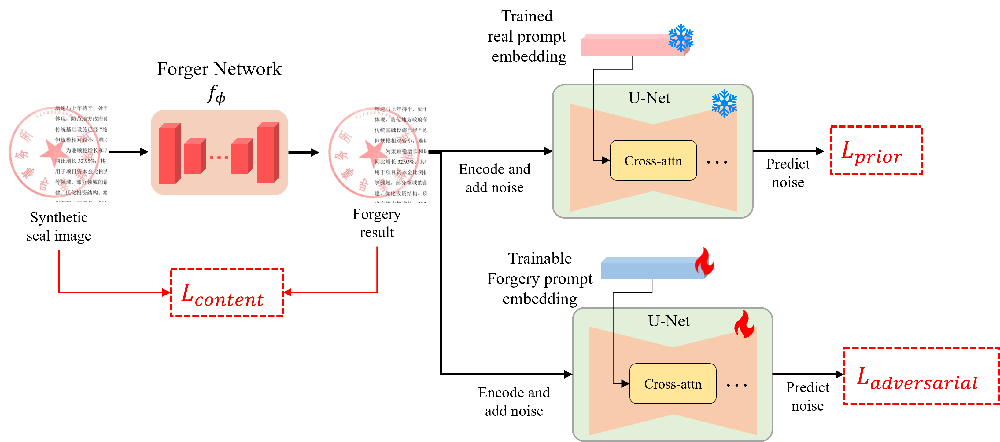

# Seal2Real: Prompt Prior Learning on Diffusion Model for Unsupervised Document Seal Data Generation and Realisation ✨

Welcome to the official repository for the Seal2Real! 🎉 This project is the PyTorch implementation for the paper **Seal2Real: Prompt Prior Learning on Diffusion Model for Unsupervised Document Seal Data Generation and Realisation**.

Our work focuses on leveraging diffusion models for the generation and editing of seal images, aiming to enhance the realism and diversity of the generated images.



## 🌟 Key Contributions

1.  **Novel Prompt Prior Learning Framework (Seal2Real):** We introduce a two-stage generative framework built upon a pre-trained Stable Diffusion model.
    *   **Stage 1 (Prompt Learning):** Learns distinct "real" and "fake" seal priors by comparing unlabeled real seal images with traditional synthetic ones. This effectively captures the nuanced characteristics of authentic seals.
    *   **Stage 2 (Forger Network):** Utilizes these learned priors to train a forger network, enabling the generation of highly realistic synthetic seal images on documents in an unsupervised manner.

2.  **Significant Improvement in Downstream Tasks:** Data generated by Seal2Real demonstrably enhances the performance of various downstream seal-related tasks, including:
    *   Seal Segmentation
    *   Authenticity Verification
    *   Text Recognition under Seals
    This validates the practical value and effectiveness of our synthetic data generation approach for real-world applications.

3.  **Open Source for Reproducibility and Further Research:** The complete code for the Seal2Real framework is publicly available, encouraging reproducibility and fostering further advancements in the field of document seal analysis and generation.


## 🛠️ Requirements

*   Python 3.8+
*   PyTorch (>=1.10)
*   Diffusers (`diffusers`)
*   Transformers (`transformers`)
*   NumPy
*   Pillow (PIL)
*   Accelerate (`accelerate`) (for distributed training and mixed precision)

## ⚙️ Installation

1.  **Clone the repository:**
    ```bash
    git clone https://github.com/Seal2Real/Seal2Real.git
    cd Seal2Real
    ```

2.  **Create and activate a virtual environment (recommended):**
    ```bash
    python -m venv venv
    source venv/bin/activate  # Linux/macOS
    # venv\Scripts\activate  # Windows
    ```

3.  **Install dependencies:**
    ```bash
    # Adjust the PyTorch installation command based on your CUDA version
    pip install torch torchvision torchaudio --index-url https://download.pytorch.org/whl/cu118
    pip install diffusers transformers numpy Pillow accelerate
    ```


## 🚀 Getting Started with Training

Once you have prepared the datasets and pre-trained files, you can start training using the following command:

```bash
python train.py
```

**Distributed Training:**
The script supports distributed training using `torch.distributed`. You can use `torchrun` or a similar launcher:
```bash
torchrun --nproc_per_node=YOUR_GPU_COUNT train.py
```
Make sure to adjust `YOUR_GPU_COUNT` according to your setup. The `--local_rank` and `--world_size` arguments in the script will be handled automatically by the launcher.

